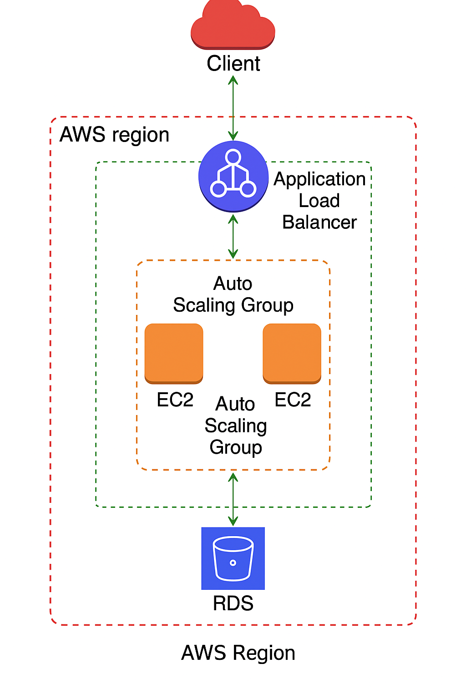

# 🛡️ Two-Tier Highly Available AWS Architecture (Terraform)

This project deploys a **redundant, secure, and scalable two-tier architecture** on AWS using Terraform.

---

## 📌 Architecture Overview



---

## 🧱 Components

### Networking (VPC Module)
- Custom VPC with DNS support
- 2x Public Subnets (across 2 AZs)
- 2x Private Subnets (across 2 AZs)
- Internet Gateway (IGW)
- NAT Gateway (optional)
- Route Tables and Subnet Associations

### Compute (EC2 + ALB + ASG)
- 2x EC2 Web Servers in Public Subnets
- Application Load Balancer (ALB) distributing traffic
- Auto Scaling Group (ASG) with policy:
  - Scale-out at CPU > 60%
  - Scale-in when load drops

### Database (RDS)
- Amazon RDS (MySQL)
- Multi-AZ enabled for high availability
- Deployed into private subnets via DB subnet group

### Security
- Security Groups:
  - Web SG: Allow HTTP/HTTPS/SSH from the world
  - RDS SG: Only allow MySQL from web SG

---

## 📁 Folder Structure
```
.
├── main.tf
├── variables.tf
├── outputs.tf
├── modules
│   ├── vpc
│   ├── ec2
│   ├── ec2-private
│   ├── alb
│   ├── asg
│   ├── sg
│   └── rds
├── assets
│   └── architecture-diagram.png
```

---

## 🚀 How to Deploy

```bash
# Initialize Terraform
terraform init

# Preview changes
terraform plan

# Apply configuration
terraform apply
```

---

## 🛠️ Variables Example (Root Level)
```hcl
vpc_cidr = "10.172.0.0/16"
public_subnets = ["10.172.0.0/24", "10.172.2.0/24"]
private_subnets = ["10.172.1.0/24", "10.172.3.0/24"]
azs = ["eu-north-1a", "eu-north-1b"]
db_username = "admin"
db_password = "SuperSecurePass123"
```

---

## 📬 Future Improvements
- Add WAF in front of ALB
- Implement SSM Session Manager for SSH-less access
- Add CloudWatch alarms and metrics dashboards
- Backup + snapshot policies for RDS

---

## 🧠 Author
**Armin Stovrag**  
Cloud Security | AWS | Terraform | Blue Team Projects

---

## ✅ License
This project is open source and free to use under the MIT License.
